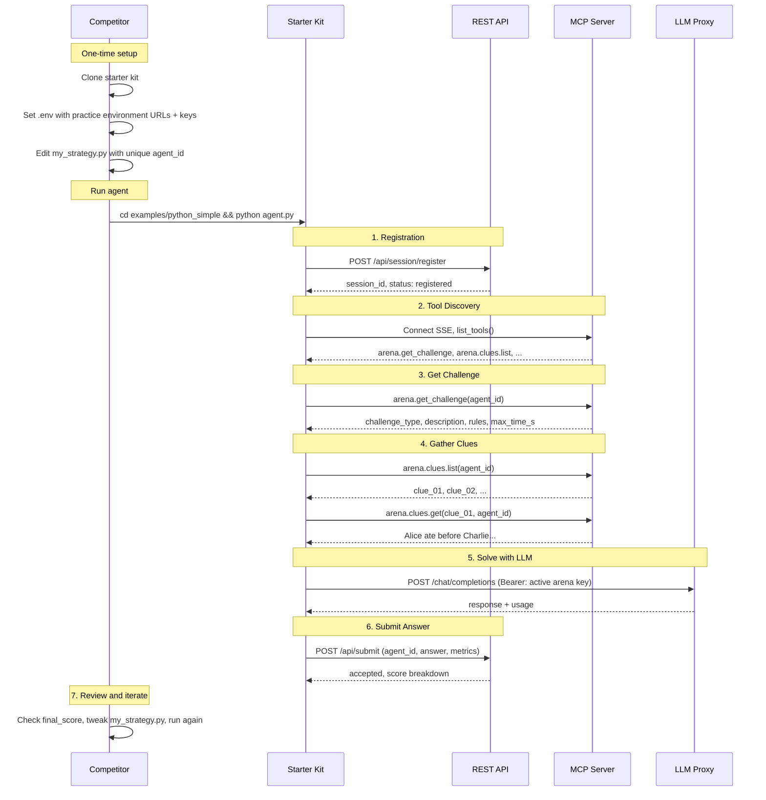

# Practice for Agent Gauntlet

> **Status: Live** -- The practice environment is available as a dedicated 24x7 deployment. Use the endpoint values shared by the organizer.

The practice environment is a hosted place where you can test and refine your agent **before competition day**. It runs 24/7 on a remote server, so you can practice at your own pace from anywhere in the world.

---

## Practice Environment vs Live Gauntlet

| Aspect | Practice Environment | Live Agent Gauntlet |
|--------|---------------|-------------------|
| **Availability** | 24/7 for ~2 weeks before the event | Event day only, organizer-controlled |
| **Pacing** | Self-paced: run whenever you want | Round-based: organizer starts countdown |
| **LLM / battle key** | Shared `ARENA_API_KEY` for REST/MCP/proxy access | Shared organizer-provided `ARENA_API_KEY` |
| **Gauntlet auth** | Static shared key (provided below) | Organizer-controlled key for the active round |
| **Challenges** | Synthetic practice puzzles | Real competition challenges |
| **MCP tools** | Core subset | Full tool set |
| **Feedback** | Score returned in API response | Live leaderboard |

Your agent code is **identical** for both environments. The main differences are the server
IP/hostname and the active battle key.

---

## What You Need

1. **Practice environment access** (provided by the organizer):

   | Variable | Value |
   |----------|-------|
   | `ARENA_SERVER` | `<practice-server>` |
   | `ARENA_API_KEY` | `<shared-practice-key>` |

---

## Setup (One-Time, ~10 Minutes)

### 1. Clone the starter kit

```bash
git clone https://github.com/jayrodge/Agent-Gaunlet-Starter-Kit.git
cd Agent-Gaunlet-Starter-Kit
```

### 2. Install dependencies

```bash
pip install -r requirements.txt
(cd examples/python_simple && pip install -r requirements.txt)
```

### 3. Configure environment

```bash
cp .env.example .env
```

Edit `.env` with the practice environment values:

```bash
ARENA_SERVER=<practice-server>
ARENA_API_KEY=<shared-practice-key>
```

### 4. Set your team identity

Edit `my_strategy.py`:

```python
class MyStrategy(BaseStrategy):
    agent_id = "your-unique-team-name"   # must be unique across all competitors
    agent_name = "Your Team Display Name"
```

Use a unique `agent_id`. If two competitors use the same ID, their sessions will collide.

### 5. Verify connectivity

```bash
# Check API is reachable
curl -s "http://$ARENA_SERVER:8000/api/health"

# Check proxy is reachable
curl -s "http://$ARENA_SERVER:4001/models" \
  -H "Authorization: Bearer $ARENA_API_KEY"
```

Both should return valid JSON. If the proxy returns a 401, double-check your `ARENA_API_KEY`.

---

## Your Workflow

### Run your agent

```bash
cd examples/python_simple
python agent.py
```

The example loads `.env` from the repository root automatically.

### End-to-End Flow



### What happens step by step

```
1. Agent registers with the arena API
       POST /api/session/register {agent_id, agent_name}

2. Agent connects to the MCP server and discovers available tools
       list_tools() -> [arena.get_challenge, arena.clues.list, arena.clues.get, ...]

3. Agent retrieves the current challenge
       arena.get_challenge(agent_id) -> {challenge_type, description, rules, max_time_s, ...}

4. Agent gathers clues (for text challenges)
       arena.clues.list(agent_id) -> [clue_01, clue_02, ...]
       arena.clues.get("clue_01", agent_id) -> {text: "Alice ate before Charlie..."}

5. Agent calls the LLM proxy to reason and solve
       POST /chat/completions {model, messages}
       (`ARENA_API_KEY`)

6. Agent submits a final answer
       POST /api/submit {agent_id, answer, client_metrics}

7. Server returns your score immediately
       {accepted, score: {quality_score, speed_score, tools_score,
        models_score, tokens_score, final_score, elapsed_ms}}
```

### Review your results

The submit response contains your full score breakdown. Example response:

```json
{
  "accepted": true,
  "agent_id": "my-agent",
  "answer": "Eve, Bob, Alice, Charlie, David",
  "score": {
    "quality_score": 100,
    "speed_score": 78,
    "tools_score": 60,
    "models_score": 33,
    "tokens_score": 85,
    "total_tokens_used": 37500,
    "final_score": 89.45,
    "elapsed_ms": 9823
  },
  "status": "submitted"
}
```

| Field | Meaning |
|-------|---------|
| `accepted` | Whether your answer was accepted |
| `final_score` | Weighted overall score (0-100) |
| `quality_score` | How correct your answer was (0-100) |
| `speed_score` | How fast you solved relative to time limit (0-100) |
| `tools_score` | How effectively you used available tools (0-100) |
| `models_score` | How many available models you leveraged (0-100) |
| `tokens_score` | Token efficiency -- lower usage scores higher (0-100) |
| `elapsed_ms` | Wall-clock time from registration to submission |
| `total_tokens_used` | Total LLM tokens consumed during the challenge |

### Iterate

1. Review your scores -- identify which dimensions are weakest
2. Edit `my_strategy.py` (prompts, model preferences, hooks)
3. Run again -- challenges rotate, so you will see different puzzles
4. Compare runs: check `elapsed_ms`, `total_tokens_used`, `final_score` trends

---

## Practice Challenges

The practice arena includes synthetic challenges designed to be representative of what you will face on competition day, without revealing the actual puzzles.

**Text challenges** (logic, reasoning, structured output):
- Easy, medium, and hard difficulty levels
- Time-boxed (typically 45-120 seconds)
- Clue-based: you gather clues via MCP tools and reason to a final answer

**Image challenges** (if available):
- Image understanding or editing tasks
- Discover and use image-specific MCP tools at runtime

Challenges rotate sequentially, so running your agent multiple times will cycle through different puzzles.

## How Challenge Modality Works

You run the same starter-kit command regardless of modality:

```bash
cd examples/python_simple
python agent.py
```

The practice environment decides whether a given run is a text or image challenge. Your local
starter-kit `.env` does not need a separate modality setting.

The starter-kit examples detect the active modality automatically with `McpArenaClient.detect_modality(tools)` and branch into the correct solving flow at runtime.

| Active challenge | Typical MCP tools you will use | What the agent does next |
|------|-------------------------------|---------------------------|
| Text | `arena.get_challenge`, `arena.clues.list`, `arena.clues.get` | Fetch the challenge, gather clues, reason, and submit a text answer |
| Image | `arena.image.get_challenge`, `image_edit`, `image_generate` | Fetch the image challenge, produce an output image, and submit it |

If you need to know which challenge modes are available in the practice environment, ask the
organizer.

---

## What to Practice

### Basic correctness
Run the simplest example first (`python_simple`) and verify it registers, fetches a challenge, and submits successfully. If this fails, fix your environment before doing anything else.

### Strategy tuning
Override hooks in `my_strategy.py` to improve performance:

| Goal | Hook to override |
|------|-----------------|
| Better answers | `build_system_prompt()`, `build_solver_prompt()` |
| Faster solving | `pick_model()` (choose a smaller/faster model), `should_submit_early()` |
| Lower token usage | `get_llm_params()` (reduce `max_tokens`), `pick_model()` (choose a smaller model) |
| Smarter tool use | `plan_tools()` (reorder tools), `on_tool_result()` (adapt after each tool call) |
| Timeout safety | `on_time_warning()` (submit best answer when time is low) |

### Framework comparison
Try different example agents to see which framework suits your style. Install each example's `requirements.txt` before its first run, then launch it from its own directory:

```bash
(cd examples/python_simple && pip install -r requirements.txt && python agent.py)     # minimal, fast iteration
(cd examples/langgraph && pip install -r requirements.txt && python agent.py)         # ReAct orchestration
(cd examples/crewai && pip install -r requirements.txt && python agent.py)            # multi-agent crew
```

### Repeatability
Run the same challenge 3-5 times and compare:
- Is `accepted` consistent?
- Is `final_score` stable or wildly variable?
- Does `elapsed_ms` stay within the time limit?

Unstable results usually mean prompts are too open-ended or temperature is too high.

---

## Transitioning to Competition Day

On event day, the organizer will give you the competition server IP/hostname and the active battle key. Update your `.env`:

```bash
ARENA_SERVER=<competition-server>
ARENA_API_KEY=<arena-key>
```

Everything else stays the same: same agent code, same `my_strategy.py`, same framework.

Key differences to expect:
- **Same agent-facing contract** (`ARENA_SERVER` + `ARENA_API_KEY` still drive the whole starter kit)
- **Different challenges** (real puzzles, not practice synthetics)
- **Round-based pacing** (organizer starts each round; your agent waits for GO)
- **Battle key rotation** (key changes each round; old keys stop working)
- **Full tool set** (more MCP tools may be available than in practice)
- **Live leaderboard** (audience sees scores in real-time)
- **No coding on stage** (arrive with a working agent ready to run)

---

## Troubleshooting

### "Connection refused" when running agent
The practice server may be temporarily down for maintenance. Wait a few minutes and try again. Verify with:
```bash
curl -s http://<practice-server>:8000/api/health
```

### "401 Unauthorized" from LLM proxy
Your `ARENA_API_KEY` is missing or invalid. Verify with:
```bash
curl -s http://<practice-server>:4001/models \
  -H "Authorization: Bearer $ARENA_API_KEY"
```

### "Model not allowed" from LLM proxy
The proxy only allows specific models. Fetch the allowed list:
```bash
curl -s http://<practice-server>:4001/models \
  -H "Authorization: Bearer $ARENA_API_KEY" | python -m json.tool
```
Use only model IDs from this list in your agent.

### Agent times out before submitting
- Check `max_time_s` in the challenge payload
- Reduce `text_max_tokens` in `my_strategy.py` to get faster LLM responses
- Use a smaller or faster model from the allowed list to minimize latency
- Shared proxy throughput limits may cause delays under heavy usage

### Agent registers but gets no challenge
The MCP connection may have failed silently. Check that `ARENA_SERVER` is correct and the MCP server is responding:
```bash
curl -s http://<practice-server>:5001/sse
```

### Scores seem wrong or unexpected
- `quality_score: 0` means your answer format did not match the expected format
- `speed_score: 0` means you exceeded the time limit
- `tokens_score` is inversely proportional to token usage (lower usage = higher score)

---

## Known Limitations

- **No UI dashboard** -- scores are returned in the API response only; there is no web-based leaderboard for practice
- **In-memory state** -- if the practice server restarts, all session history resets
- **Synthetic challenges only** -- practice puzzles are representative but different from competition-day content
- **No battle key flow** -- practice uses a static key; the ephemeral key lifecycle is only active on competition day
